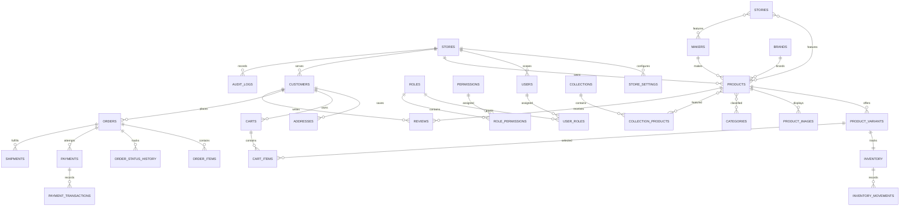

# Mavera Product Architecture

**Powered by Mavera**

**Initial storefront: Kijiji Works — Contemporary Craft & Heritage**

## 1. Product architecture

Mavera is a configurable commerce engine delivered first as a branded,
single-merchant storefront. The platform owns reusable commerce and content
capabilities; a `Store` configuration owns branding, locale, catalog, enabled
features, policies, navigation, homepage composition, and payment/shipping
configuration. Kijiji Works is the first store experience, not the platform's
permanent identity or a reason to specialize the engine around craft alone.

The initial architecture is a JavaScript modular monolith:

```text
Browser (React storefront and merchant console)
                 │ REST / JSON
Node.js application (modular monolith)
                 │
PostgreSQL ─ object storage ─ payment/shipping/email adapters
```

Keep the current React/Vite JavaScript frontend and use a JavaScript Node.js
REST backend with PostgreSQL.
Organize backend modules by business capability and share one database and
deployment initially. Use explicit service boundaries for payment, tax,
shipping, email, media, and search integrations so they can be replaced without
rewriting product or order logic.

### Product boundaries

- **Platform:** shared application, permissions, payment adapter contracts,
  operational tooling, and future store provisioning.
- **Store:** tenant boundary for all merchant-owned catalog, customer, order,
  inventory, content, policies, and settings.
- **Merchant:** people and teams authorized to operate a store; marketplace
  ownership/payout features are not in the first milestone.
- **Customer:** store-scoped account, addresses, wishlists, and order history.
- **Product narrative:** optional, configurable sections that connect product
  identity to maker, origin, process, provenance, collection, and editorial.
  Media roles cover main, gallery, lifestyle, detail, process, maker/workshop,
  and moderated community imagery.

## 2. User personas

| Persona | Goals | Needs and constraints |
| --- | --- | --- |
| Curious customer | Discover a distinctive object and understand its value | Clear story, trusted maker/origin details, useful imagery, transparent delivery and returns |
| Confident buyer | Select the right product and complete a reliable purchase | Accurate variants and availability, clear total, secure payment, order updates |
| Maker or studio owner | Present work and maintain product authenticity | Maker profile, process and provenance fields, limited editions, simple content editing |
| Store operator | Keep catalog, stock, and orders accurate | Validated product forms, inventory history, order lifecycle, low-stock visibility |
| Store manager | Coordinate staff and performance | Granular permissions, auditability, operational metrics, store-level settings |
| Platform operator | Support multiple independent stores | Tenant isolation, health and error visibility, secure provisioning; no cross-store data leakage |

## 3. User journeys

### Customer discovery to fulfillment

1. Browse the configurable homepage, collection, maker, story, category, search,
   and product detail without creating an account.
2. Explore product media, variants, availability, maker, origin, materials,
   process, provenance, edition, and related editorial as configured.
3. Select a valid variant/customization and add it to a guest cart without
   signing in.
4. When the customer chooses checkout or Buy now, require signup or login and
   return them to their intended purchase flow after successful authentication.
5. Submit customer, address, shipping, and discount details. The server reloads
   product/variant prices and stock, then calculates the authoritative total.
6. Create a pending payment attempt with a provider. Verify provider webhooks
   before marking payment paid, creating/confirming the order, or decrementing
   inventory.
7. Send confirmation and subsequent shipment/refund notifications; show the
   same order status to merchant and customer.

### Merchant publishing and operations

1. Sign in with a server-authenticated account and store-scoped permissions.
2. Create a collection and maker, then a product with variants, validated
   media, narrative sections, provenance, and stock.
3. Preview, publish, and feature content through the storefront configuration.
4. Review order and inventory alerts, process fulfillment, and inspect
   store-scoped performance.

The current frontend does not implement these production journeys. In
particular, its localStorage authentication and alert-driven checkout are
explicitly non-production and must be removed rather than extended.

## 4. Information architecture

### Storefront

```text
Home
├── Shop
│   ├── Categories and filters
│   ├── Product detail
│   └── Search
├── Collections
├── Makers
├── Stories
├── About
├── Account
│   ├── Profile and preferences
│   ├── Orders and order detail
│   ├── Addresses
│   ├── Wishlist
│   └── Security and notifications
├── Cart
├── Checkout
└── Legal, contact, shipping, and returns
```

Navigation nodes and optional sections are configured per store; disabled
features should not leave broken or empty routes.

### Merchant console

```text
Dashboard
├── Products / Variants / Categories
├── Collections
├── Makers / Brands
├── Inventory / Adjustments
├── Orders / Shipments / Refunds
├── Customers
├── Reviews
├── Stories
├── Discounts
├── Storefront / Homepage / Navigation
├── Analytics
└── Settings / Team / Policies
```

## 5. Feature map and MVP boundary

| Capability | MVP | Extension point |
| --- | --- | --- |
| Store config and theme tokens | One store, configurable identity/locale/theme | Store provisioning and custom domains |
| Catalog | Products, categories, brands, makers, variants, attributes, media | External feeds and advanced attribute schemas |
| Storytelling | Maker profiles, product narrative/provenance, collections, shoppable stories | Rich editorial blocks and campaign scheduling |
| Discovery | Server-backed search, facets, sort, pagination | Dedicated search index behind search service |
| Inventory | Variant-level available/reserved quantities and movement ledger | Multi-location inventory |
| Cart and checkout | Guest/authenticated cart, server pricing, shipping/tax/discount calculation | Saved carts and additional regional payment methods |
| Payment and orders | Provider abstraction, verified webhook, order state history | Additional payment providers, refunds and payouts |
| Customer | Secure auth, addresses, orders, wishlist | Social login, loyalty |
| Merchant admin | Product, inventory, order, content, collection, settings workflows | Granular analytics and staff workflow automation |
| Operations | Migrations, CI checks, health, structured logs, backups | Error tracking and production monitoring integrations |
| Marketplace | Not in MVP | Merchant onboarding, commissions, settlements, payouts |

Production checkout is blocked until a real payment provider, credentials, and
webhook endpoint are configured. Anonymous users are prompted to sign up or log
in when they choose a purchase action. A provider failure must fail visibly; it
must never be converted to a successful payment or order.

## 6. Relational data model

All merchant-owned rows are scoped by `store_id`, including customers, carts,
orders, content, and inventory. Foreign keys should preserve store consistency
(composite constraints where appropriate). Use UUID primary keys, UTC timestamps,
database constraints for invariants, and indexes for tenant-scoped access. Use
soft deletion only for records that require recovery/audit; transactional
records remain immutable or status-transitioned.



### Core entities and invariants

- `stores`: `id`, unique `slug`, display identity, `status`, timestamps.
- `store_settings`: store-scoped key/value or typed JSON settings with validated
  schemas for locale, currency, timezone, theme, feature flags, navigation,
  homepage sections, policies, and integrations. Secrets are references to a
  secret manager, never stored as public settings.
- `users`, `roles`, `permissions`, `user_roles`, `role_permissions`: hashed
  credentials and store-scoped RBAC; platform roles are separate and narrowly
  assigned.
- `customers`: store-scoped customer identity/auth profile; unique normalized
  email per store where account policy requires it.
- `products`: store-scoped title/slug, status, descriptive fields, maker/brand
  links, flexible validated attributes and configurable narrative sections.
  Unique `(store_id, slug)`.
- `product_variants`: product-scoped SKU, option values, price in integer
  minor units, currency, weight, publication/availability. Unique SKU per
  store. Price is authoritative server-side.
- `product_media`: object-storage key, alt text, caption, dimensions, order,
  media type, role, captions/transcript references, and moderation state. Roles
  include main, gallery, lifestyle, detail, process, maker, workshop, and
  customer/community. Customer media must be moderated before publication;
  purchase verification must be derived from an order, never a client claim.
  Never trust client-provided MIME type or file path.
- `categories`, `collections`, `makers`, `brands`, `tags`: first-class
  store-scoped entities; collection membership is ordered and publishable.
- `inventory`: variant-scoped `on_hand`, `reserved`, low-stock threshold and
  version. Constraint: `on_hand >= 0`, `reserved >= 0`,
  `reserved <= on_hand`; available is `on_hand - reserved`.
- `inventory_movements`: append-only adjustments/reservations/releases with
  actor, reason, reference, and timestamp.
- `carts`, `cart_items`: guest token or customer owner; item references a
  variant and quantity, never a trusted price. Merge is a server transaction.
- `orders`, `order_items`, `order_status_history`: immutable address/product/
  price snapshots, integer minor-unit totals, currency, status, idempotency key,
  transition actor and audit timestamps.
- `payments`, `payment_transactions`: provider and provider reference,
  idempotent status transitions, amount/currency, webhook event identifiers.
  Do not store card data.
- `shipments`, `refunds`, `coupon_redemptions`: provider/tracking references,
  bounded state changes, unique redemption and usage constraints.
- `stories`, `story_products`, `story_makers`: published editorial blocks with
  shoppable references and ordered relationships.
- `wishlists`, `wishlist_items`, `reviews`: customer ownership, verified
  purchase state derived from orders, moderation audit.
- `notifications`, `audit_logs`: delivery state and sensitive administrative
  actions with actor/store scope.
- `addresses`: customer-owned records plus immutable order-time address
  snapshots; never let later address edits rewrite past orders.

Use explicit join tables instead of opaque arrays for queryable relations.
Flexible attributes/story sections may use JSONB only for merchant-defined
presentation data; identity, prices, status, ownership, inventory, and
relationships remain relational.

## 7. REST API specification

Base path `/api/v1`; JSON responses; UUID IDs; opaque pagination cursor or
bounded `limit`/`offset`; consistent error envelope:

```json
{
  "error": {
    "code": "VALIDATION_ERROR",
    "message": "The request could not be processed.",
    "details": [{ "field": "quantity", "message": "Must be a positive integer." }],
    "requestId": "..."
  }
}
```

Never return stack traces or secret/provider details. Public read endpoints are
store-domain/slug scoped, rate limited where appropriate, and return only
published content. Admin endpoints require authenticated user, store membership,
and a specific permission. Mutating transaction endpoints accept idempotency
keys.

| Route | Access | Purpose |
| --- | --- | --- |
| `GET /storefront` | Public | Store identity, locale, enabled navigation/theme |
| `GET /products` | Public | Search/filter/sort/paginate published products |
| `GET /products/:slug` | Public | Product narrative, variants, maker and provenance |
| `GET /categories`, `/collections`, `/makers`, `/stories` | Public | Published discovery content |
| `GET /search/suggest?q=` | Public | Bounded autocomplete results |
| `POST /auth/register`, `/auth/login` | Public/rate-limited | Secure account creation and session |
| `POST /auth/logout`, `/auth/password-reset` | Auth/public | Revoke session or initiate reset |
| `GET/POST /cart`, `PATCH/DELETE /cart/items/:id` | Guest token or auth | Server-validated cart operations |
| `POST /checkout/quote` | Guest token or auth | Recalculate subtotal, discount, shipping, tax, total |
| `POST /checkout/sessions` | Guest token or auth | Create pending order/payment attempt |
| `POST /webhooks/payments/:provider` | Provider signature | Verify and idempotently apply provider events |
| `GET /account/orders`, `/account/addresses` | Customer auth | Customer-owned data only |
| `GET /admin/products`, `/admin/orders`, `/admin/customers` | Scoped permission | Paginated merchant operations |
| `POST/PATCH /admin/products`, `/admin/collections`, `/admin/makers`, `/admin/stories` | `*.write` | Merchant content management |
| `POST /admin/inventory/adjustments` | `inventory.write` | Audited, concurrency-safe stock adjustment |
| `PATCH /admin/orders/:id/status` | `orders.update` | Validated order transition |
| `GET /health/live`, `/health/ready` | Operational | Process and dependency readiness, no secrets |

Use typed validation at route boundaries (for example Zod schemas in JavaScript),
parameterized database queries, explicit services for pricing/discount/tax/
shipping/inventory, and centralized error mapping. Search starts with indexed
PostgreSQL full-text/trigram search behind a search service interface; a
dedicated engine can replace it later.

## 8. Frontend architecture

Keep JavaScript and Vite. Move toward feature-oriented modules as the real API
is introduced:

```text
src/
  app/                 # router, providers, configuration
  components/
    ui/                # accessible primitives
    commerce/          # product, cart, price, provenance components
    layout/             # storefront and merchant shells
  features/
    catalog/ cart/ checkout/ auth/ account/ orders/
    makers/ collections/ stories/ admin/ storefront/
  services/             # API client and feature services
  lib/                  # formatting, validation, runtime config
  styles/               # tokens, global styles, theme variables
```

Pages consume API/service state, not local hardcoded catalogs or browser-trusted
prices. Keep an API boundary so frontend behavior does not depend on the
eventual database or provider. Show explicit loading, empty, validation,
provider-failure, and retryable error states. Protect merchant routes by server
authorization; client route guards are UX only, never access control.

## 9. Design system

### Foundations

Use an editorial baseline with a restrained craft palette for Kijiji Works:
warm paper, ink, muted earth, and one configurable accent. Theme values are CSS
custom properties loaded from store configuration, not scattered brand
constants. Use a display serif for editorial headlines and a highly legible
sans-serif for interface/body text; provide system fallbacks and self-hosted,
licensed font files when selected.

Define tokens for typography scale, 4px-based spacing, content widths, 12-column
desktop grid, responsive gutters, border colors, restrained radii, subtle
shadows, motion durations/easing, and breakpoints. Respect
`prefers-reduced-motion`; do not make motion necessary to understand state.

### Components

Build semantic, keyboard-operable buttons, links, labeled fields, selects,
checkboxes/radios, dialogs/drawers, menus, tabs, accordions, tooltips, toasts,
breadcrumbs, pagination, skeletons, and empty/error states. Every interactive
component has visible focus, accessible name/state, adequate contrast, and
touch-size targets.

The storefront must work across narrow phones, tablets, laptops, and wide
desktops: responsive images, no horizontal overflow, touch-friendly controls,
reflowing product/gallery layouts, and checkout forms usable with touch,
keyboard, and assistive technology. Authentication is a purchase gate, not a
browsing gate.

Product galleries provide keyboard-operable thumbnail selection, meaningful
alt text, lazy loading for secondary media, native video controls, captions,
and transcript links when supplied. Optional lifestyle, close-up, process,
maker/workshop, and moderated community-photo sections appear only when
published media exists; customer images are never presented as verified
purchases unless linked to a completed order.

Commerce components include configurable `ProductCard`, `ProductGallery`,
`ProductPrice`, `ProductVariantSelector`, `AddToCart`, `CartItem`,
`CartSummary`, `CheckoutForm`, `OrderSummary`, `ReviewCard`, `MakerCard`,
`CollectionCard`, `StoryCard`, and `ProvenanceTimeline`. Components render only
configured and available data; missing optional sections do not create empty
ornamentation.

### Themes

`Editorial`, `Studio`, `Technical`, `Heritage`, and `Minimal` are token/layout
presets, not unrelated component forks. Store settings control type, palette,
density, homepage sections/order, and product section order. Kijiji Works begins
with the Heritage/Editorial blend but retains a clear platform/store boundary.

## 10. Backend architecture

```text
backend/
  src/
    auth/ users/ stores/ permissions/
    catalog/ categories/ collections/ makers/ stories/
    inventory/ cart/ checkout/ orders/ payments/
    shipping/ tax/ discounts/ customers/ reviews/
    notifications/ admin/ analytics/
    middleware/ database/ integrations/
  migrations/
  tests/
```

Each domain owns route handlers, schemas, services, and repositories. Keep
business invariants in services/transactions, not React or route handlers.
Modules share a PostgreSQL connection pool and migrations. Use transactions for
cart merge, inventory reservations, order creation, payment event application,
and state transitions. Add outbox/retry infrastructure only when reliable
delivery requirements and scale justify it; no microservices or message bus in
the first release.

Provider contracts should cover payment intent/session creation, webhook
verification, refunds, shipping quotes/labels, email, media storage, and tax.
The provider implementation is selected per store where supported. Store
secrets stay server-side in environment/secret management.

## 11. Deployment architecture

- **Local:** frontend and Node API; PostgreSQL via a local container; environment
  example file with placeholders only; migrations are explicit.
- **CI:** pull-request lint, unit/API tests, build, dependency/security checks,
  migration validation, and integration tests using an isolated PostgreSQL
  service.
- **Staging:** production-like managed PostgreSQL, isolated credentials,
  payment-provider sandbox, object storage, webhook endpoint, smoke/E2E checks.
- **Production:** deploy frontend and API as managed web services/containers;
  managed PostgreSQL with encrypted automated backups and restore drills;
  object storage/CDN for media; TLS, environment secrets, health/readiness
  probes, structured logs and error/uptime monitoring.
- **Release:** additive migration, deploy compatible code, backfill if needed,
  then remove deprecated schema only in a later release. Rollback must not
  destroy committed orders or inventory history.

The hosting provider is not selected yet. Avoid Kubernetes and platform-specific
coupling until deployment requirements justify them.

## 12. Security model

- Passwords use a current adaptive password hash (Argon2id preferred); never
  store plaintext or reversible passwords. Prefer server-managed secure,
  `HttpOnly`, `Secure`, `SameSite` cookies and CSRF defenses for cookie sessions.
- Use server-side session revocation, email verification and expiring,
  single-use password reset tokens. Rate-limit authentication, search, and
  sensitive writes; return non-enumerating auth responses.
- Deny by default. Resolve store membership and granular RBAC on every admin
  request. Enforce tenant ownership in repositories/queries and test cross-store
  access explicitly.
- Recompute item prices, promotions, tax, shipping, stock, and totals on the
  server. Use row locks or optimistic version checks for reservations and
  adjustments. The browser never declares an order paid.
- Verify webhook signatures against the raw request body, validate timestamp/
  replay policy, persist unique provider event IDs, and process idempotently.
- Validate and encode untrusted input at boundaries; use parameterized SQL,
  output escaping, secure headers, strict CORS allowlists, request size limits,
  and CSRF protection as applicable.
- Validate uploads by size, decoded file type, and safe image processing;
  store outside the application filesystem and serve with safe content headers.
- Store secrets only in deployment secret management; redact credentials,
  tokens, payment payloads, and sensitive personal data from logs.
- Keep audit records for permission, settings, inventory, refund, and order
  actions. Define retention and deletion workflows for customer data.
- Add dependency auditing and secret scanning to CI; document incident response
  and database restore procedures before production launch.

## 13. Testing and observability strategy

### Tests

- **Unit:** money/rounding, discounts, tax/shipping calculations, permissions,
  inventory availability/reservation/release, cart merge, state transitions.
- **API:** validation, auth/session, tenant scoping, catalog filtering, cart,
  checkout quote, webhook verification/idempotency, admin authorization.
- **Integration:** PostgreSQL transactions and migrations; cart → quote →
  provider event → paid order → inventory update; failed/replayed payment events.
- **E2E:** browse/search/product story, variant/cart, checkout, account/order
  visibility, merchant publish/manage order, keyboard/mobile critical paths.
- **Access gate:** anonymous visitors can browse/search/product pages and add to
  cart; checkout and Buy now route to signup/login; successful auth returns to
  the intended purchase flow; invalid credentials never open checkout.
- **Quality gates:** lint/build, test suite, dependency/security checks,
  accessibility checks on primary storefront and admin flows.

Never mark provider checkout covered by a mocked success alone. Provider
sandboxes and signed test webhooks are required for end-to-end payment checks.

### Observability

Emit structured logs with request/correlation ID, store ID, route, result,
latency, and safe entity references. Add live/ready health endpoints, database
pool and migration visibility, payment attempt/webhook failure metrics, email
delivery metrics, low-stock/order alerts, and error reporting with sensitive
data redaction. Provide administrators a traceable payment/order failure reason
without exposing provider secrets or customer payment data.

## 14. Implementation roadmap

### Phase 0 — Architecture and guardrails (this phase)

- Establish this product/data/API/security/deployment blueprint.
- Replace the course README with honest product setup/status documentation.
- Confirm commerce provider and deployment requirements before integration.

### Phase 1 — Production foundation

- Remove localStorage password auth, fake checkout, alerts, demo catalog, and
  Vite/ShopHub branding.
- Add neutral platform/store configuration and Kijiji Works editorial design
  system; maintain accessible responsive layouts.
- Create the modular JavaScript API server, PostgreSQL migrations, health checks,
  environment validation, request logging, and CI baseline.
- Allow public browsing and guest cart selection, backed by published API data.
  Require server-backed customer signup/login before checkout or Buy now.
- Keep payment and order creation disabled until a provider and verified
  webhook integration are selected.

### Phase 2 — Storefront content and catalog

- Implement tenant-scoped stores/settings, categories, products/variants,
  makers, collections, media, stories, publishing, and configurable homepage.
- Build public catalog/search/product/maker/collection/story REST endpoints and
  connect the React storefront.
- Add product narrative, provenance, schema-driven optional sections, SEO and
  responsive media behavior.

### Phase 3 — Identity, inventory, and cart

- Expand customer sessions with email verification/reset; add merchant
  authentication, RBAC, store-scoped customer accounts, and audit logs.
- Implement inventory movements and concurrency-safe available stock.
- Implement guest/authenticated carts and safe cart merging.

### Phase 4 — Checkout, payments, and orders

- Implement authoritative server-side pricing, discounts, shipping/tax quotes,
  checkout idempotency, and immutable order snapshots.
- Integrate the selected real payment provider and signature-verified webhook.
- Implement order history, status transitions, notifications, shipments, and
  merchant operations. Do not launch checkout without provider verification.

### Phase 5 — Merchant operations and launch

- Complete product/inventory/order/customer/content/settings admin workflows,
  analytics, moderation, legal pages, and operational alerts.
- Complete accessibility, security, performance, backup/restore, staging,
  payment sandbox, E2E, and production readiness reviews.

### Phase gates

At each phase, run targeted tests, inspect storefront/admin UX, validate
migrations and database constraints, exercise API behavior, and review
authorization/security before starting the next phase. A phase is not production
ready merely because its UI renders.

## Current repository assessment

The repository now has a React/Vite storefront, initial Node REST API,
PostgreSQL migrations for stores/catalog/inventory/customer sessions, public
catalog read routes, and server-backed customer signup/login with scrypt-hashed
passwords and opaque database sessions. The storefront reads published catalog
data from the API; the current cart is in-memory only. There is still no
merchant administration, inventory mutation service, persistent cart, payment
provider, order lifecycle, deployment pipeline, email verification, or
production monitoring. Checkout explicitly creates no order and takes no
payment.
